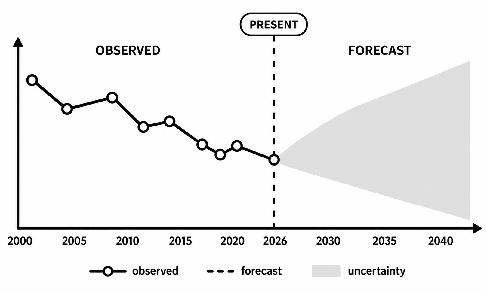
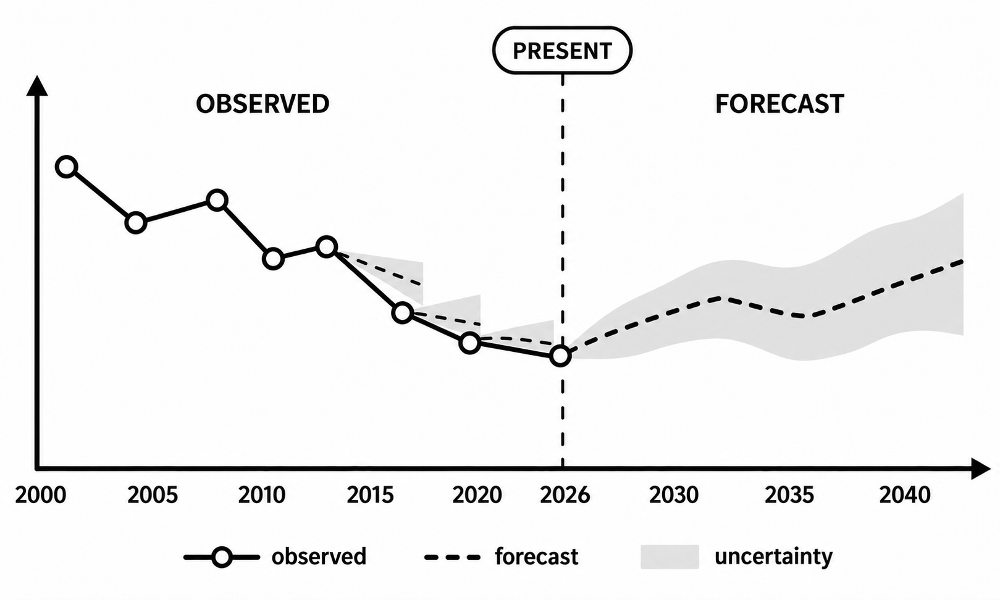
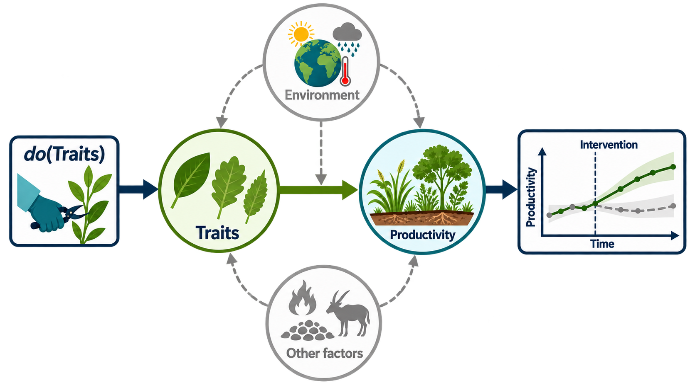
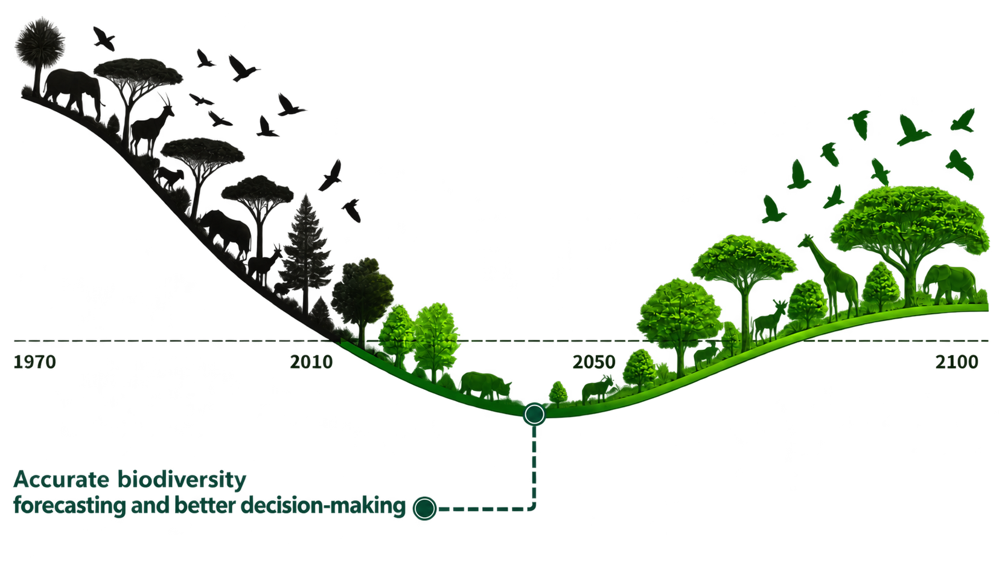

##  Why is it an exciting time to be working in statistical ecology? {.center style="text-align: center;"}

##  {.center background-image="img/NG/Drosera capensis_flower_noBG.png" background-size="350px" background-position="right bottom"}

{width="80%" height="80%" fig-align="left"}

::: footer
Image Credit: Adam Islaam | IIASA | Based on Leclère et al. 2020 _Nature_ https://doi.org/10.1038/s41586-020-2705-y
:::

## Forecasting Biodiversity Trajectories? {auto-animate="true" auto-animate-easing="ease-in-out" style="text-align: center;"}

:::::: columns
::: {.column width="45%"}
Current State

[Predicting biodiversity dynamics is hampered by fragmented, inconsistent or context-dependent theory.]{style="font-size: 0.8em;"}

:::

:::: {.column width="45%"}
::: fragment
Desired State

[Coherent integrative theory allows prediction of biodiversity dynamics and iterative learning from new observations.]{style="font-size: 0.8em;"}
:::
::::
::::::

## The Challenges {auto-animate="true" auto-animate-easing="ease-in-out" style="text-align: center;"}

::::::::: center
:::::::: columns
::: {.column width="30%"}
Complexity of Biodiversity

:::

:::: {.column width="30%"}
::: fragment
Incomplete Observation

:::
::::

:::: {.column width="30%"}
::: fragment
Limited Causal Inference

:::
::::
::::::::
:::::::::

::: fragment
_We haven't had the tools needed to test and integrate theory across the scales required for prediction of biodiversity!_
:::

## Solutions? {style="text-align: center;"}

:::::: columns
::: {.column width="45%"}
Incomplete Observation

:::

:::: {.column width="45%"}
::: fragment
Sensors and Citizen Science

Satellites provide observations from metres to the globe, while ground-based sensors and citizen scientists provide rich in situ data
:::
::::
::::::

## Solutions? {style="text-align: center;"}

:::::: columns
::: {.column width="45%"}
Limited Causal Inference

:::

:::: {.column width="45%"}
::: fragment
Modern Causal Statistics

Allows us to test causation at the scale of observations
:::
::::
::::::

## Solutions? {auto-animate="true" auto-animate-easing="ease-in-out" style="text-align: center;"}

:::::: columns
::: {.column width="45%"}
Complexity of Biodiversity

:::

:::: {.column width="45%"}
::: fragment
Trait-Based Ecology

Mechanistic links between scales from organism to ecosystem and Nature's Contributions to People
:::
::::
::::::

::: fragment
_For those who need to simplify..._
:::

## Solutions! {style="text-align: center;"}

::::::::: center
:::::::: columns
::: {.column width="30%"}
Tractable Measurements

[ ]{style="display: block; margin-top: 1.5em;"}

:::

:::: {.column width="30%"}
Dense observations

::::

:::: {.column width="30%"}
Causal Statistics

::::
::::::::
:::::::::

 

:::fragment
_Combining these solutions makes biodiversity theory testable and continuously falsifiable across spatial and temporal scales._
:::

## {auto-animate="true" auto-animate-easing="ease-in-out" style="text-align: center;"}

Ultimately allowing better prediction to inform decisions...

## {auto-animate="true" auto-animate-easing="ease-in-out" style="text-align: center;"}

::::::::: center

{width="80%"}

... and a better future for biodiversity and Nature's Contributions to People

:::::::::

##  {.center}

{width="90%" height="90%" fig-align="center"}