##  {.center}

{width="90%" height="90%" fig-align="center"}

::: {.notes}
I live in a Global Biodiversity Hotspot and one of the most botanically diverse regions of the world. My house is a stone's throw away from where I took this picture in Table Mountain National Park, which is home to almost 3000 vascular plant species.

Unfortunately, it is changing.

In 2017, members of this team and I published the first documented evidence of climate-change driven diversity loss in this region.

Since then, we've experienced a 3-year megadrought - the worst on record, multiple heatwaves, extreme heavy rainfall and flooding events, and aseasonal fires are becoming increasingly common.
:::

##  {.center}

{width="90%" height="90%" fig-align="center"}

::: {.notes}
This is a photo I took near my house a week or two ago. 

The combination of an out-of-season fire and a failed rainy season has resulted in roughly 90% mortality in these large shrubs. This is incredibly unusual given they are fire-resistant and typically live for 50-100 years.

What's happening to the thousands of less conspicuous species we simply don't know. Neither do we know the implications for Nature's Contributions to People like carbon storage, water provision or future fire regimes.

Sadly, I think most of us can tell a similar story of change and uncertainty about the ecosystems we know and love, whether it be the result of fire, climate, invasive species or a myriad of other drivers.
:::

##  {.center background-image="img/NG/Drosera capensis_flower.jpg" background-size="300px" background-position="right"}

{width="80%" height="80%" fig-align="left"}

::: footer
Image Credit: Adam Islaam | IIASA | Based on Leclère et al. 2020 _Nature_ https://doi.org/10.1038/s41586-020-2705-y
:::

::: {.notes}

This uncertain state and trajectory of biodiversity and associated contributions to people is not unique to my home. It's a global crisis.

We can observe that biodiversity is changing. We can identify many of the drivers. But we can't reliably predict how biodiversity will respond, or determine which mechanisms are responsible, across the scales at which environmental change is occurring.

That is the scientific problem BioTRaCE is designed to solve.

//And while we may know many of the drivers, we lack the ability to confidently track and forecast their impacts or future trajectories in any specific landscape under different intervention scenarios.

:::

## Forecasting Biodiversity Trajectories {auto-animate="true" auto-animate-easing="ease-in-out" style="text-align: center;"}

:::::: columns
::: {.column width="45%"}
Current State

[Predicting biodiversity dynamics is hampered by fragmented, inconsistent or context-dependent theory.]{style="font-size: 0.8em;"}

:::

:::: {.column width="45%"}
::: fragment
Desired State

[Coherent integrative theory allows prediction of biodiversity dynamics and iterative learning from new observations.]{style="font-size: 0.8em;"}
:::
::::
::::::

:::{.notes}
We need to be able to rapidly detect and forecast change and its drivers in order to be agile in response to threats to nature and its contributions to people.

Unfortunately, this is rarely feasible for most ecosystems at scales at which management interventions can be applied, largely because existing theory is fragmented, inconsistent or context dependent.

We need coherent integrative theory that facilitates prediction of biodiversity dynamics and allows iterative learning as new observations are made.
:::

<!-- 

##  {.center background-image="img/NG/Adenandra villosa_2.jpg" background-size="300px" background-position="right"}

::::: columns
::: {.column width="70%"}
### We will develop a unified framework for iteratively testing theory to biodiversity dynamics and Nature's Contributions to People across space and time.
:::

::: {.column width="30%"}
:::
:::::

::: {.notes}
[Or drop this slide and go directly into the 3 core challenges?]
:::

##  {.center background-image="img/NG/Adenandra villosa_2.jpg" background-size="300px" background-position="right"}

{width="80%" height="80%" fig-align="left"}

::: footer
A unified framework for iteratively testing theory and predicting biodiversity dynamics and Nature's Contributions to People across space and time.
:::

::: {.notes}
[Or present something like this and say "We will develop a unified framework for iteratively testing theory and predicting biodiversity dynamics and Nature's Contributions to People across space and time."?]
:::

-->

## Three Empirical Challenges {auto-animate="true" auto-animate-easing="ease-in-out" style="text-align: center;"}

::::::::: center
:::::::: columns
::: {.column width="30%"}
Complexity of Biodiversity

:::

:::: {.column width="30%"}
::: fragment
Incomplete Observation

:::
::::

:::: {.column width="30%"}
::: fragment
Limited Causal Inference

:::
::::
::::::::
:::::::::

::: fragment
_We haven't had the tools needed to test and integrate theory across the scales required for prediction of biodiversity!_
:::

::: {.notes}
Endeavours to achieve this have been hampered by three empirical challenges...

The first is conceptual: How do we reduce the innate variation and complexity of biodiversity in a way that allows us to explore mechanistic processes and linkages?

- For example, the Cape Floristic Region is home to >9000 vascular plant species. We can't hope to directly model every single one of them. Most have few or no data points and many more that are yet to be described!

The second is data-limitation: How do we overcome the challenges associated with patchy biodiversity observations in space and time?

- This visualization of species locality records curated by the Global Biodiversity Information Facility reveals many dark parts on the map. The record is even patchier when explored over time, and there are long delays between field observation and data being available for modelling. To forecast trajectories with confidence we need good, high-frequency data.

The third is methodological. How do we test hypotheses and infer causation at the scales relevant to biodiversity prediction?

- Historically, our only tool has been randomised control trials. These are logistically and financially constrained, and even some of the largest and longest running, such as the Park Grass Experiment shown here, are only up to the size of a small farm. 
- This means that much of our current theory has only been properly tested at limited spatial and temporal extents, and rarely replicated, and there are many reasons they may not hold at broader scales as assumptions and the relative importance of processes change.

In short, we simply haven't had the tools to build a coherent body of integrative theory for understanding and forecasting biodiversity and its contributions to people.
:::

## Three Solutions {auto-animate="true" auto-animate-easing="ease-in-out" style="text-align: center;"}

:::::: columns
::: {.column width="45%"}
Complexity of Biodiversity

:::

:::: {.column width="45%"}
::: fragment
Trait-Based Ecology

Mechanistic links between scales from organism to ecosystem and Nature's Contributions to People
:::
::::
::::::

:::fragment
_Makes quantifying biodiversity tractable._
:::

:::{.notes}
Fortunately, the past few decades and recent developments are allowing us to overcome these challenges.

Firstly, trait-based ecology allows us to simplify the complexity of biodiversity and explore mechanistic links and processes that scale from individual organisms to ecosystems and Nature's Contributions to People, such as carbon sequestration, provision of clean water, or even human well-being.

This makes quantifying and modelling biodiversity tractable.
:::

## Three Solutions {style="text-align: center;"}

:::::: columns
::: {.column width="45%"}
Incomplete Observation

:::

:::: {.column width="45%"}
::: fragment
Satellite Remote Sensing

Provides repeated observations at scales from metres to the globe
:::
::::
::::::

:::fragment
_Makes biodiversity observable._
:::

:::{.notes}
Secondly, satellite remote sensing provides repeated observations at scales from metres to the globe, which when paired with ground observations can tell us a lot about the state and trajectory of various facets of biodiversity.

This makes biodiversity observable.
:::

## Three Solutions {style="text-align: center;"}

:::::: columns
::: {.column width="45%"}
Limited Causal Inference

:::

:::: {.column width="45%"}
::: fragment
Modern Causal Statistics

Allows us to test causation at the scale of observations
:::
::::
::::::

:::fragment
_Makes theory and drivers testable across scales._
:::

:::{.notes}
Third, burgeoning methods in modern causal statistics are freeing us from the constraints of randomised control trials and allowing us to infer causation at scales that match our observations and application.

This makes theory and the drivers of biodiversity change testable across scales.
:::

## Three Solutions {style="text-align: center;"}

::::::::: center
:::::::: columns
::: {.column width="30%"}
Trait-Based Ecology

[ ]{style="display: block; margin-top: 1.5em;"}

:::

:::: {.column width="30%"}
Remote Sensing

::::

:::: {.column width="30%"}
Causal Statistics

::::
::::::::
:::::::::

 

:::fragment
_Combining these solutions would be transformative, because it makes biodiversity theory testable and continuously falsifiable across spatial and temporal scales._
:::

:::{.notes}
Combining these solutions would be transformative, because it makes biodiversity theory testable and continuously falsifiable across spatial and temporal scales.

This is exactly what we need to develop a coherent body of theory for forecasting the trajectories of biodiversity and Nature's Contributions to People!

This is our offering.
:::

## BioTraCE {background-image="img/BioTraCE_Team2.png" background-position="center"}

::::: columns
:::: {.column width="25%"}

<!--
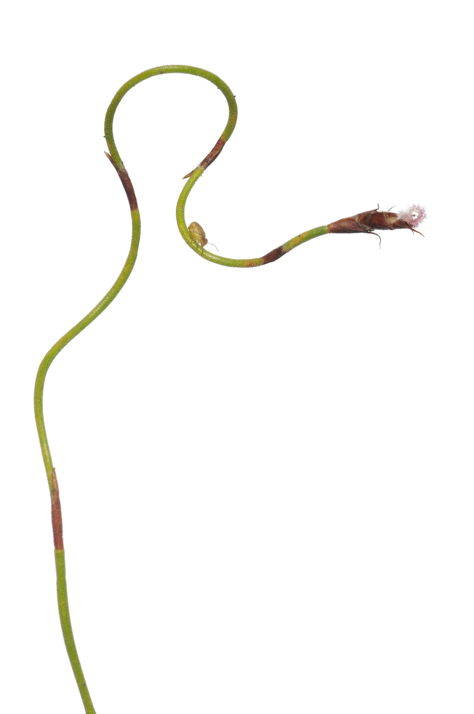{width="30%" height="30%" fig-align="left"}
-->

::: {.fragment style="font-size: 0.7em;"}

 

- Remote Sensing of Biodiversity
- Theoretical Ecology
- Trait-based Ecology
- Statistical Ecology
- Hydroclimatology
- People and Nature
- Conservation Planning
- Science and Policy
- and more...

:::

::::
:::::

:::{.notes}
BioTraCE has the team to combine these solutions to create something transformational for biodiversity theory, observation and forecasting.

No single discipline can do this. Our team brings together the people who have independently developed each component, and now allows us to integrate them.

We represent three of the 5 MTEs, where we will focus the initial work, and have data and experience in many others.
:::

## Combining the solutions {auto-animate="true" auto-animate-easing="ease-in-out" style="text-align: center;"}

Mapping traits with hyperspectral remote sensing

:::::: columns
::: {.column width="30%"}

:::

:::: {.column width="65%"}

{.absolute bottom=0 right=50 width="200" height="100"}
::::
::::::

:::{.notes}
Firstly, members of our team have been leading efforts to map plant traits from imaging spectroscopy (hyperspectral remote sensing), groundtruthed with field data.

- Here we see false colour composites of 18 NEON landscapes in the US with three traits, Phenolics, Chlorophyll and Leaf Mass per unit Area mapped to red, green and blue. As you can see, these images reveal clear variation in these traits within and between landscapes, revealing the legacies of ecological histories and land-use.
:::

## Combining the solutions {auto-animate="true" auto-animate-easing="ease-in-out" style="text-align: center;"}

Mapping traits with hyperspectral remote sensing

:::::: columns
::: {.column width="30%"}

 
:::

:::: {.column width="65%"}
::: fragment
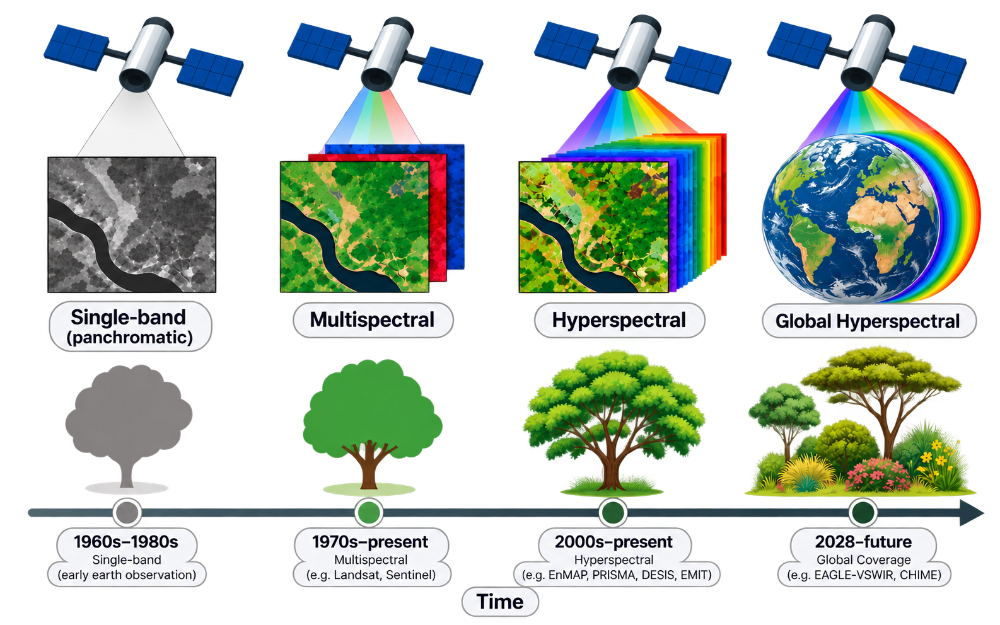
:::
::::
::::::

:::{.notes}
[Explain evolution of IS and what this means]

Our team members are also involved in the development of hyperspectral satellite missions (such as NASA's Eagle and ESA's CHIME), that are scheduled to be launched in 2028.
:::

## Combining the solutions {auto-animate="true" auto-animate-easing="ease-in-out" style="text-align: center;"}

Trait time-series from multispectral satellites

:::::: columns
::: {.column width="30%"}
 
:::

:::: {.column width="65%"}
::: fragment
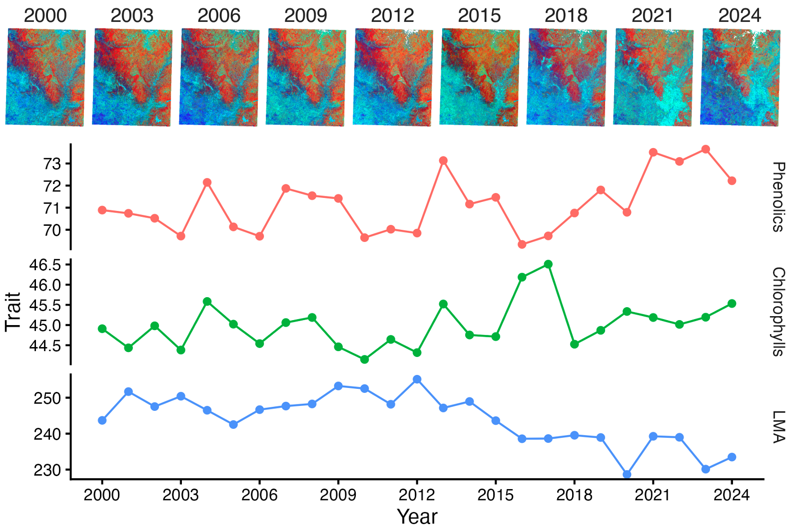
{.absolute bottom=0 right=50 width="200" height="100"}
:::
::::
::::::

:::{.notes}
Time-series of traits from hyperspectral satellites will be transformational for biodiversity science and monitoring, but existing airborne and satellite data are patchy in space and time.

To prepare for regular acquisition of hyperspectral satellite data with continuous coverage, we'll use field data and patchy imagery from airborne campaigns and existing space-borne platforms to calibrate and develop trait time-series from existing multidecadal multispectral satellite records, such as Landsat and Sentinel.

This figure shows...

This allows us to build biodiversity datasets at spatial and temporal extents and resolutions that have never been available to science before.

Not only does this present new opportunities to test existing theory, it is very likely to reveal phenomena that we have never seen before.
:::

## Combining the solutions {auto-animate="true" auto-animate-easing="ease-in-out" style="text-align: center;"}

Causal analysis of theory and drivers of traits and NCP

:::::: columns
::: {.column width="30%"}
 
:::

:::: {.column width="65%"}
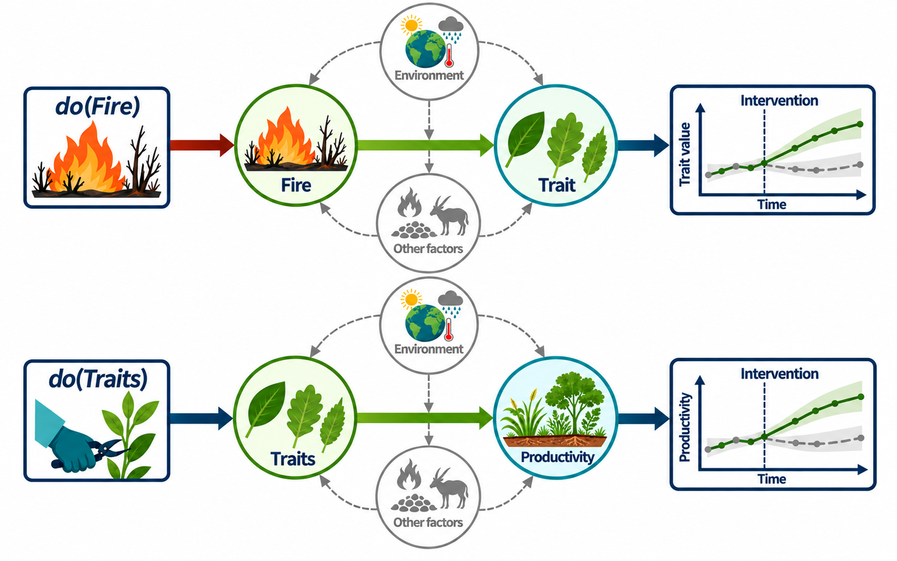
::::
::::::

:::{.notes}
Combining these dense spatial and temporal datasets with causal statistics allows us to test the predictions of theory and the drivers of traits and NCP at the scales at which they are most relevant for observation, prediction, or societal application.
:::

## Combining the solutions {auto-animate="true" auto-animate-easing="ease-in-out" style="text-align: center;"}

And iterative forecasting of traits and NCP under different scenarios

:::::: columns
::: {.column width="30%"}
 
:::

:::: {.column width="65%"}
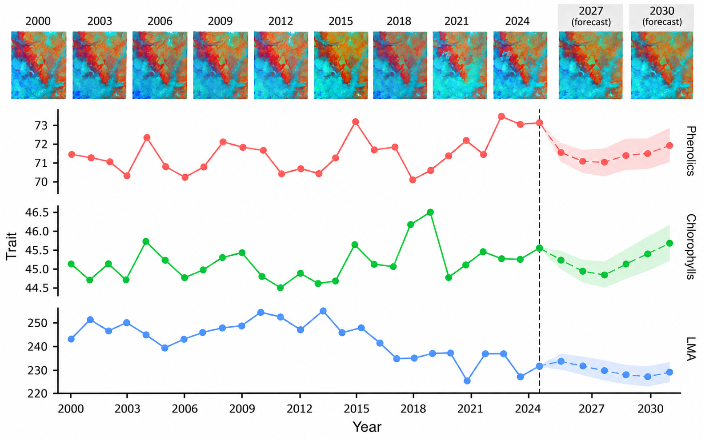
::::
::::::

:::{.notes}
We can then develop iterative forecasts of traits and NCP that update as new imagery are acquired and processed. 

We'll transition from multispectral to hyperspectral satellite data when they become available, which is roughly midway through the project cycle.

This allows us to leverage crucial information from decades of existing data, but then refine the models as the higher quality hyperspectral data become available.
:::

<!--

## Combining the solutions {style="text-align: center;"}

Use counterfactual models and forecasts to test causal drivers and theory

:::::: columns
::: {.column width="30%"}
 
:::

:::: {.column width="65%"}

::::
::::::

:::{.notes}
The models and iterative forecasts will serve multiple purposes.

Firstly, we will use them for causal inference, by intervening on key variables or adding or altering mechanistic processes in the model to explore counterfactual scenarios. These hypothetical "what if" situations allow inference of cause-and-effect relationships by comparing reality to alternative outcomes.

Secondly, they can be used to inform the management of biodiversity and Nature's Contributions to People by detecting and attributing change as it happens or exploring potential outcomes under different decision scenarios.

:::

-->

## A framework to harmonize theory {style="text-align: center;"}

Describing eco-evolutionary dynamics by harmonizing existing theory in a common trait-based framework

:::::: columns
::: {.column width="70%"}
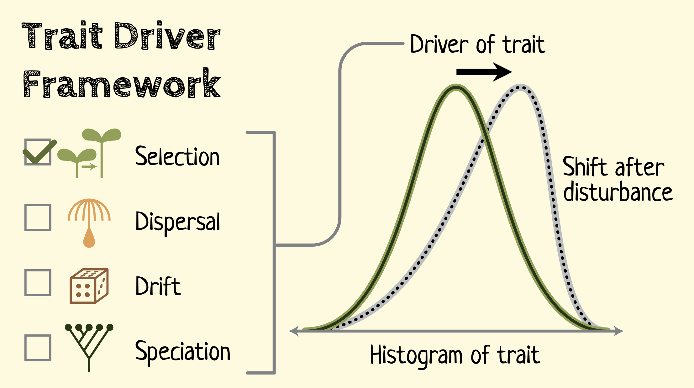
:::

:::: {.column width="30%"}
::: {style="font-size: 0.9em;"}
 

Synthesizing theory across physiology, population biology, evolutionary biology, community ecology, ecosystem ecology, and global ecology.
:::
::::
::::::

:::{.notes}
We'll also apply a different approach, leveraging the trait time series and knowledge gained from the forecasts and causal models in a Trait Driver Framework.

The framework recasts context-dependent community assembly theories in the common currency of individual traits and community trait distributions, linking dynamics to selection, dispersal, drift, and speciation. 

This theoretical approach borrows from quantitative genetics and allows us to translate theories operating at different ecological scales into a common trait-based representation to make competing theories directly comparable on the same data, and allowing us to partition the contribution of different process. 
:::

<!--

## Our Team {background-image="img/BioTraCE_Team2.png" background-position="center"}

::::: columns
:::: {.column width="25%"}
::: {.fragment style="font-size: 0.7em;"}
- Remote Sensing of Biodiversity
- Statistical Ecology
- Theoretical Ecology
- Community Ecology
- Trait Ecology
- Landscape Ecology
- Hydroclimatology
- People and Nature
- Conservation Planning
- Science and Policy
- and more...

:::
::::
:::::

:::{.notes}
No single discipline can do this. Our team brings together the people who have independently developed each component, and now allows us to integrate them.

Our team represent three of the 5 MTEs, where we will focus the initial work, and have data and experience in many others and include the broad range of skills necessary to complete this project, from field to theoretical ecology to remote sensing, social ecological systems and conservation policy.
:::

-->

## BioTraCE Success {auto-animate="true" auto-animate-easing="ease-in-out" style="text-align: center;"}

::::::::: center

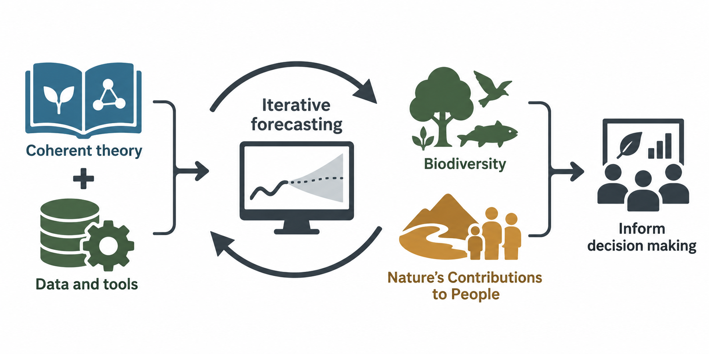{width="65%"}

Coherent theory and tools for iterative forecasting of biodiversity and Nature's Contributions to People to inform decision making

:::::::::

:::{.notes}
A coherent body of theory and tools for iterative forecasting of biodiversity and NCP to inform decision making.

//Of course our main goal behind developing the learning framework is to identify and test existing theory and develop new theory to improve our ability to forecast trajectories for biodiversity and NCP. So success would be to have theory-informed iterative forecasts up and running.

[Not sure about these chatGPT-generated graphics. I'd like to put more thought into what they're showing. Suggestions welcome!]
:::

## BioTraCE Success {auto-animate="true" auto-animate-easing="ease-in-out" style="text-align: center;"}

::::::::: center

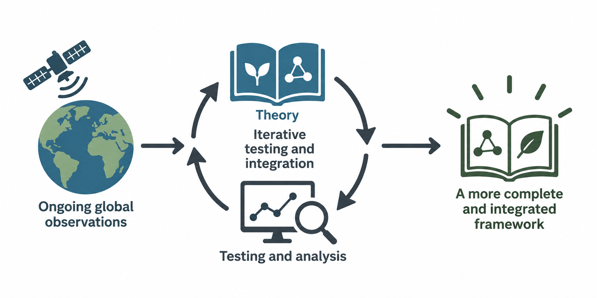{width="65%"}

A framework for iterative testing and integration of theory informed by ongoing global observations

:::::::::

:::{.notes}
An open source framework and tools for iterative, automated, testing and integration of theory informed by ongoing global observations.

//Once developed, the learning framework and tools would allow further development and testing of theory well beyond the lifetime of the project.

[Not sure about these chatGPT-generated graphics. I'd like to put more thought into what they're showing. Suggestions welcome!]
:::

## BioTraCE Success {auto-animate="true" auto-animate-easing="ease-in-out" style="text-align: center;"}

::::::::: center

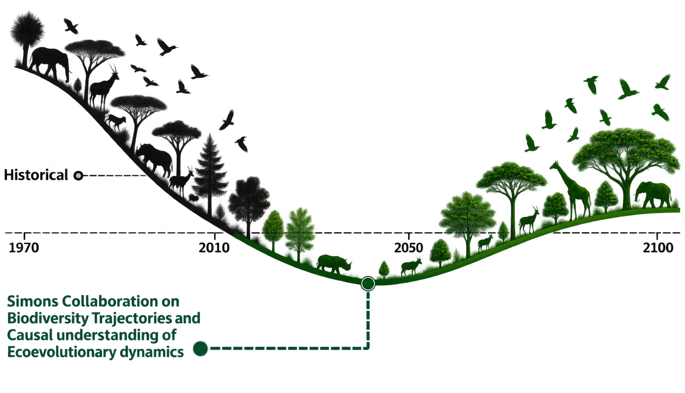{width="80%"}

A better future for biodiversity and Nature's Contributions to People

:::::::::

:::{.notes}
And it goes without saying that we'd like to see better managed biodiversity and Nature's Contributions to People.
:::

##  {.center style="text-align: center;"}

{width="90%" height="90%" fig-align="center"}
[**BioTraCE**: A Unified Framework for Understanding and Predicting Biodiversity Change]{style="font-size: 0.8em;"}

:::{.notes}
[Closing slide]
:::

##  {background-video="img/Simons_Fig_Anim_smaller.mp4" background-video-muted="true" background-size="contain"}

:::{.notes}
We've structured the project around 4 working groups, each with their own set of work packages, questions and responsibilities, but together they form an iterative learning cycle that allows us to learn and share across groups.

The Theory and Synthesis group involves the entire team and others and is responsible for both guiding the other groups and iteratively reviewing, synthesizing and redistributing knowledge gained within the project, while also engaging with the needs of biodiversity management and policy decision-makers.

Working group 2 will focus on developing rich biodiversity and environmental time-series from satellite and airborne imagery, field data and expert elicitation. This is the fuel for working group 3 and 4.

Working group 3 is focused on developing iterative ecological forecasting models and causal analysis to detect and attribute drivers of biodiversity change and test theory.

Working group 4 will use the data and findings from WG 2 and 3 in a Trait Driver Framework to reframe existing theory in terms of traits and test their utility for biodiversity prediction (again Cory - Help?).

:::

<!--

## What success looks like? {auto-animate="true" auto-animate-easing="ease-in-out" style="text-align: center;"}

::::::::: center
:::::::: columns
::: {.column width="30%"}

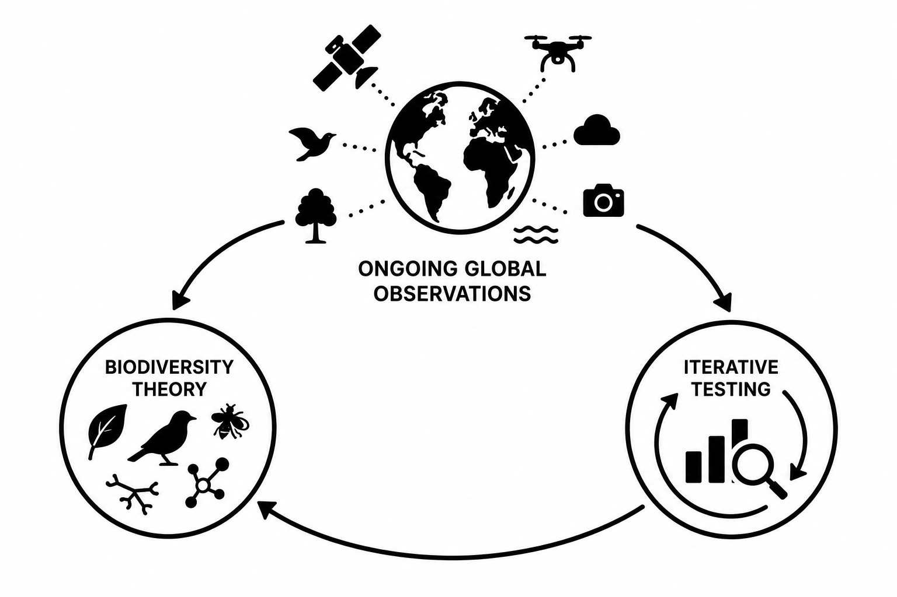
A framework for iterative testing and integration of theory informed by ongoing global observations

:::

:::: {.column width="30%"}

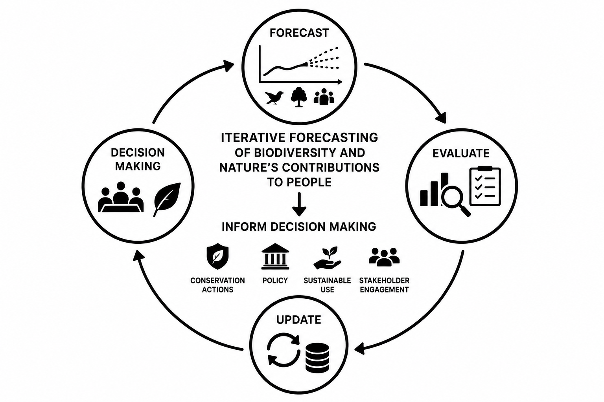
Theory-informed iterative forecasting of biodiversity and NCP to inform decision making

::::

:::: {.column width="30%"}

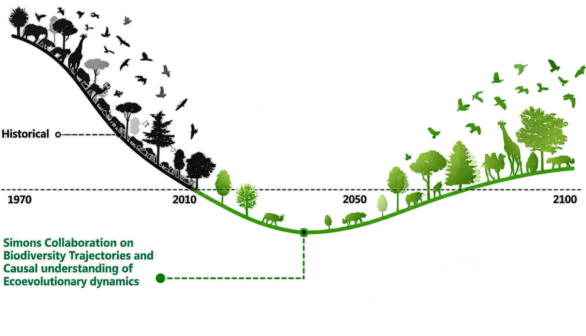
 

Better managed biodiversity and Nature's Contributions to People

::::

::::::::
:::::::::

# BioTraCE {.center style="text-align: center;" background-image="img/NG/Ischyrolepis tenuissima_Female.jpg" background-size="500px" background-position="left"}

:::{.notes}
BioTraCE will combine these solutions to create something transformational for biodiversity theory, observation and forecasting.
:::

## What success looks like? {auto-animate="true" auto-animate-easing="ease-in-out" style="text-align: center;"}

That's it!

Struggling a bit with "What success looks like?"

##

## BioTraCE {.center background-image="img/NG/Adenandra villosa.jpg" background-size="400px" background-position="right"}

::::: columns
::: {.column width="70%"}
### Providing a unified, testable framework for predicting biodiversity dynamics and Nature's Contributions to People across space and time.
:::

::: {.column width="30%"}
:::
:::::

## Hide Slide From Counter {visibility="uncounted"}

-->