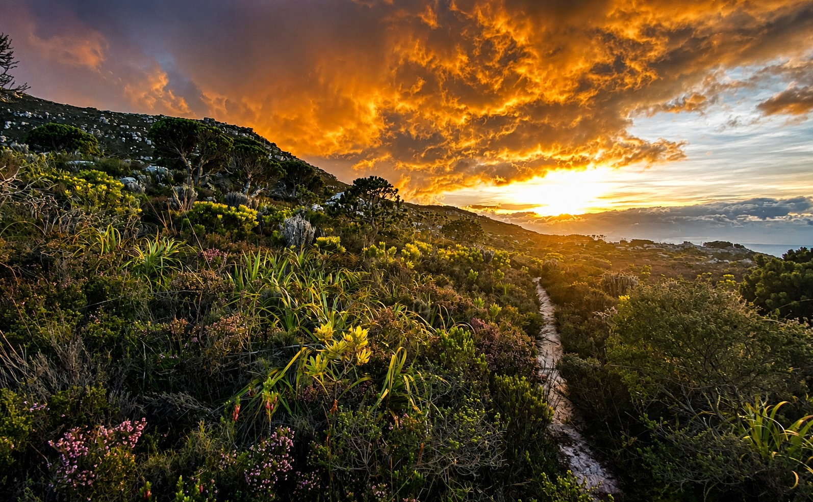
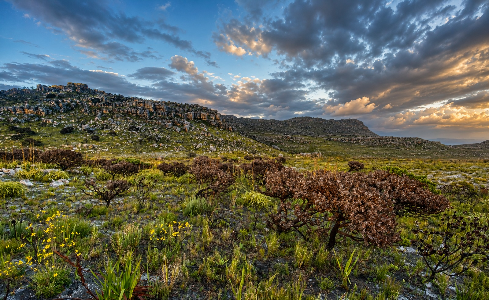
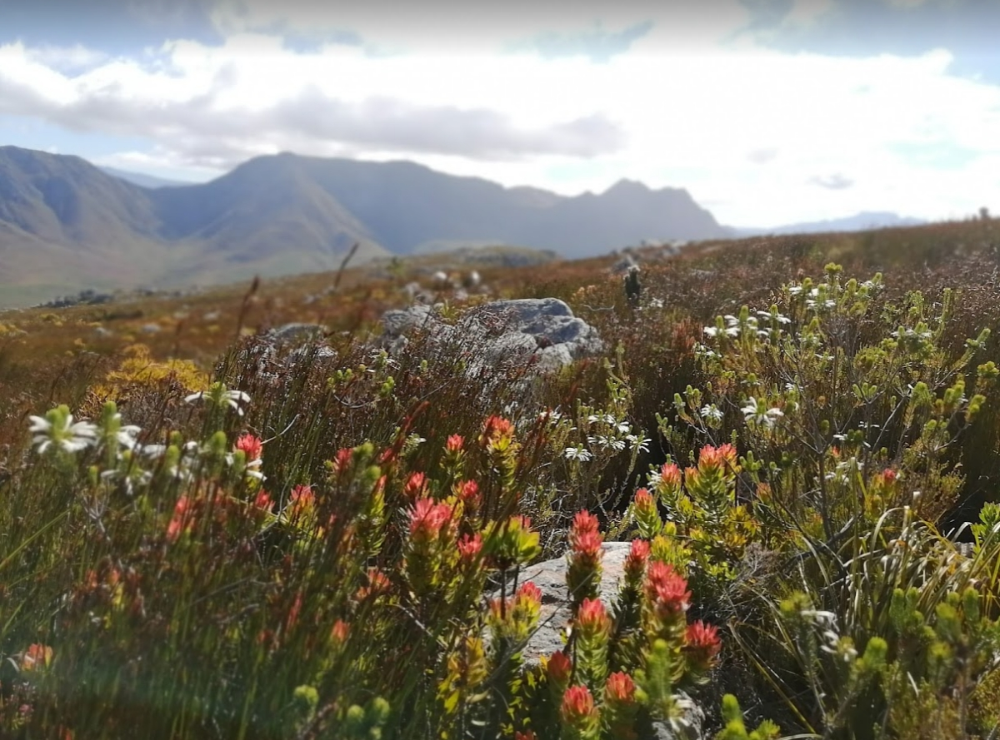
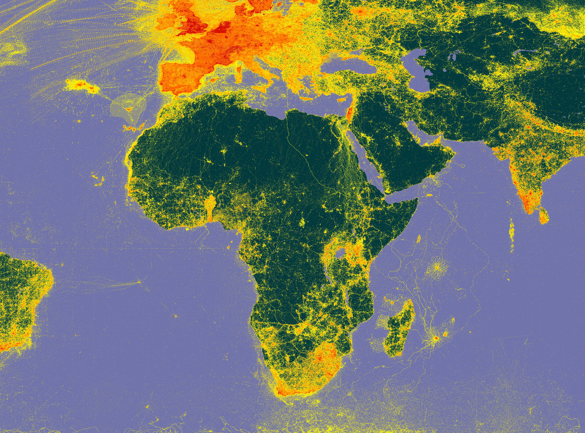
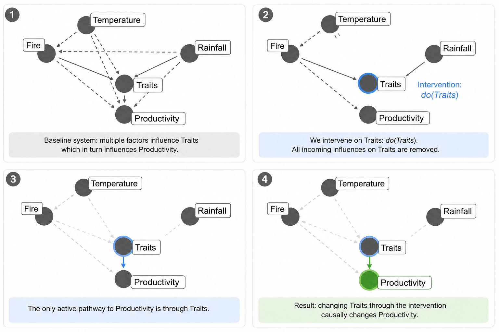
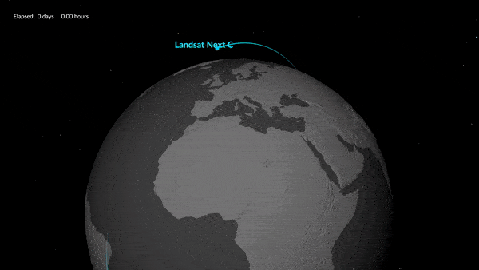
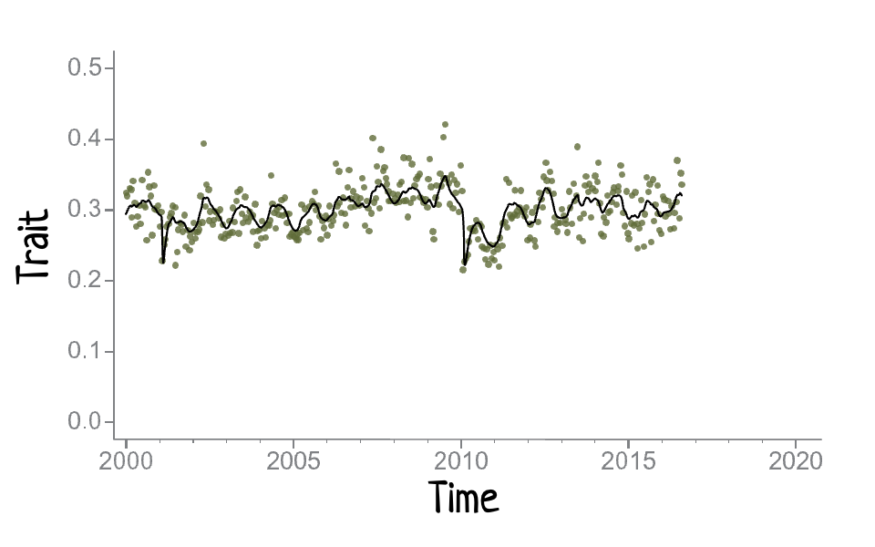
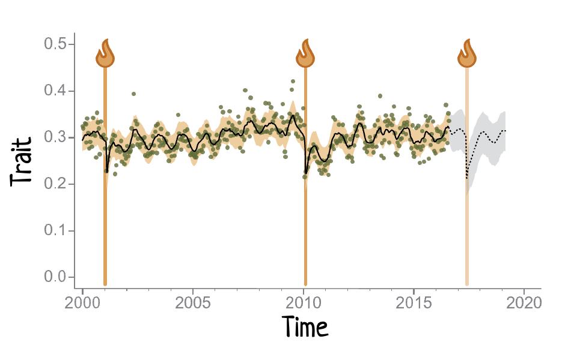
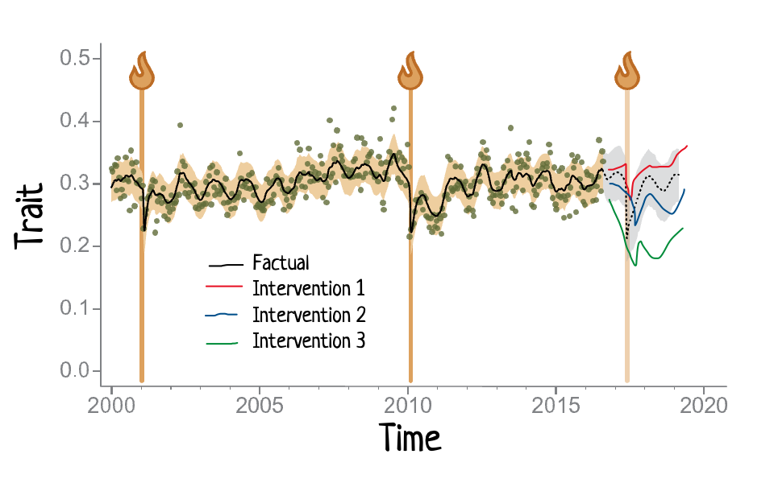
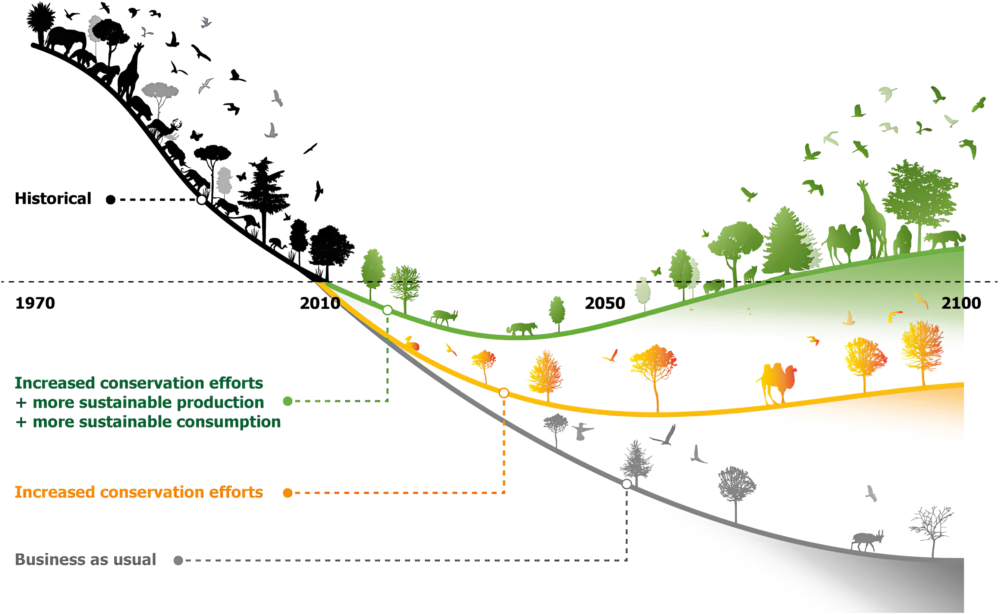

##  {.center}

{width="90%" height="90%" fig-align="center"}

::: {.notes}
I live in a Global Biodiversity Hotspot and one of the most botanically diverse regions of the world. My house is a stone's throw away from Table Mountain National Park, which is home to almost 3000 vascular plant species.
:::

##  {.center}

{width="90%" height="90%" fig-align="center"}

::: {.notes}
Unfortunately, this is changing.

In 2017, some members of this team and I published the first documented evidence of climate-change driven diversity loss in this region.

Since then, the region has experienced a 3-year megadrought, multiple floods from extreme heavy rainfall, and aseasonal fires.

This is a photo I took near my house a week or two ago. The combination of an out-of-season fire and barely any rain this wet season has resulted in 80-90% mortality in these large fire-resistant shrubs. 

What is happening to the rest of the thousands of less conspicuous species we'll only know once we've censused and analysed our permanent vegetation survey plots in the area.
:::

##  {.center background-image="img/NG/Drosera capensis_flower.jpg" background-size="300px" background-position="right"}

{width="80%" height="80%" fig-align="left"}

::: {.notes}

This uncertain state and trajectory of biodiversity and associated contributions to people is not unique to my home. It is a global crisis.

And while we may know many of the drivers, we lack the ability to confidently track and forecast their impacts or future trajectories under different intervention scenarios.

:::

##  {.center background-image="img/NG/Adenandra villosa_2.jpg" background-size="300px" background-position="right"}

::::: columns
::: {.column width="70%"}
### We will develop a unified framework for iteratively testing theory and predicting biodiversity dynamics and Nature's Contributions to People across space and time.
:::

::: {.column width="30%"}
:::
:::::

::: {.notes}
[Or drop this slide and go directly into the 3 core challenges?]
:::

##  {.center background-image="img/NG/Adenandra villosa_2.jpg" background-size="300px" background-position="right"}

{width="80%" height="80%" fig-align="left"}

::: footer
A unified framework for iteratively testing theory and predicting biodiversity dynamics and Nature's Contributions to People across space and time.
:::

::: {.notes}
[Or present something like this and say "We will develop a unified framework for iteratively testing theory and predicting biodiversity dynamics and Nature's Contributions to People across space and time."?]
:::

## Three Core Challenges {auto-animate="true" auto-animate-easing="ease-in-out" style="text-align: center;"}

::::::::: center
:::::::: columns
::: {.column width="30%"}
Biodiversity

:::

:::: {.column width="30%"}
::: fragment
Observation

:::
::::

:::: {.column width="30%"}
::: fragment
Inference

:::
::::
::::::::
:::::::::

::: {.notes}
Developing the ability to forecast biodiversity trajectories with confidence requires addressing three core challenges...

Firstly, we need to reduce the innate variation and complexity of biodiversity if we are to explore mechanistic processes and linkages.

- For example, the Cape Floristic Region is home to >9000 vascular plant species and many more that are yet to be described. We cannot hope to directly model every single one of them.

Secondly, we need to overcome challenges associated with patchy biodiversity observations in space and time.

- This visualization of all species locality records in the Global Biodiversity Information Facility reveals many dark parts on the map. The record is even patchier when explored over time. One cannot model trajectories without data.

Third, historically, we have only been able to test causal relationships with randomised control trials. 

- These are logistically and financially constrained, and even some of the largest and longest running, such as the Park Grass Experiment shown here, are only up to the size of a small farm. 
- This means that much of our current theory has only been properly tested at limited spatial and temporal extents, and there are many reasons they may not hold at broader scales as assumptions and the relative importance of processes change.
:::

## Three Solutions {auto-animate="true" auto-animate-easing="ease-in-out" style="text-align: center;"}

:::::: columns
::: {.column width="45%"}
Diversity

:::

:::: {.column width="45%"}
::: fragment
Trait-Based Ecology

Mechanistic links between scales from organism to ecosystem and Nature's Contributions to People
:::
::::
::::::

:::{.notes}
Fortunately, the past few decades and recent developments are allowing us to overcome these challenges.

Firstly, trait-based ecology allows us to simplify the complexity of biodiversity and explore mechanistic links and processes that scale from individual organisms to ecosystems and Nature's Contributions to People, such as carbon sequestration, provision of clean water, or even human well-being.
:::

## Three Solutions {style="text-align: center;"}

:::::: columns
::: {.column width="45%"}
Observation

:::

:::: {.column width="45%"}
::: fragment
Satellite Remote Sensing

Provides repeated observations at scales from metres to the globe
:::
::::
::::::

:::{.notes}
Secondly, satellite remote sensing provides repeated observations at scales from metres to the globe, which when paired with ground observations can tell us a lot about the state and trajectory of various facets of biodiversity.
:::

## Three Solutions {style="text-align: center;"}

:::::: columns
::: {.column width="45%"}
Inference

:::

:::: {.column width="45%"}
::: fragment
Modern Causal Statistics

Allows us to test causation at the scale of observations
:::
::::
::::::

:::{.notes}
Third, burgeoning methods in modern causal statistics are freeing us from the constraints of randomised control trials and allowing us to infer causation at scales that match our observations and application.
:::

## Combining the solutions {auto-animate="true" auto-animate-easing="ease-in-out" style="text-align: center;"}

Trait maps from field surveys and imaging spectroscopy

:::::: columns
::: {.column width="30%"}

:::

:::: {.column width="65%"}
::: fragment

:::
::::
::::::

::: fragment
{.absolute bottom=0 right=0 width="200" height="100"}
:::

:::{.notes}
Our team have been working on these solutions and the potential to combine them to create something transformational for biodiversity theory, observation and forecasting.

Firstly, members of our team have been leading efforts to map plant traits from imaging spectroscopy (hyperspectral remote sensing) groundtruthed with field data.

Here we see false colour composites of 18 NEON landscapes in the US with three traits, Phenolics, Chlorophyll and Leaf Mass per unit Area mapped to red, green and blue. As you can see, these images reveal drastic variation in these traits within and between landscapes, revealing the legacy of ecological or land-use histories.

Our team members have also been involved in the development of hyperspectral satellite missions (NASA's Eagle and ESA's CHIME), that are to be launched in the next 2-3 years.
:::

## Combining the solutions {auto-animate="true" auto-animate-easing="ease-in-out" style="text-align: center;"}

Trait time-series from multispectral satellites

:::::: columns
::: {.column width="30%"}
 
:::

:::: {.column width="65%"}
::: fragment

:::
::::
::::::

:::{.notes}
Time-series of traits from hyperspectral satellites will be transformational for biodiversity science and monitoring, but existing airborne and satellite data are patchy in space and time.

An intermediate approach, to prepare for regular hyperspectral satellite data with continuous coverage, is to use field data and trait maps from airborne campaigns to calibrate and develop trait time-series from existing multispectral satellite records such as Landsat or Sentinel.
:::

## Combining the solutions {style="text-align: center;"}

Model and forecast trait time-series

:::::: columns
::: {.column width="30%"}
 
:::

:::: {.column width="65%"}

::::
::::::

## Combining the solutions {style="text-align: center;"}

Use counterfactual forecasts to test causal drivers and theory

:::::: columns
::: {.column width="30%"}
 
:::

:::: {.column width="65%"}

::::
::::::

## A common framework to unify theory! {style="text-align: center;"}

Describing eco-evolutionary dynamics by harmonizing existing theory in a trait-based framework

:::::: columns
::: {.column width="70%"}

:::

:::: {.column width="30%"}
::: {.fragment style="font-size: 0.9em;"}
 

Synthesizing theory across physiology, population biology, evolutionary biology, community ecology, ecosystem ecology, and global ecology.
:::
::::
::::::

##  {background-video="img/Simons_Fig_Anim_smaller.mp4" background-video-muted="true" background-size="contain"}

## Our Team {background-image="img/BioTraCE_team.png" background-position="center"}

::::: columns
:::: {.column width="25%"}
::: {.fragment style="font-size: 0.7em;"}
- Remote Sensing of Biodiversity
- Statistical Ecology
- Theoretical Ecology
- Community Ecology
- Trait Ecology
- Landscape Ecology
- Hydroclimatology
- People and Nature
- Conservation Planning
- Science and Policy
- and more...

:::
::::
:::::

## What success looks like? {auto-animate="true" auto-animate-easing="ease-in-out" style="text-align: center;"}

::::::::: center
:::::::: columns
::: {.column width="30%"}
Fynbos?

:::

:::: {.column width="30%"}
::: fragment
Global Biodiversity?

:::
::::

:::: {.column width="30%"}
::: fragment
Global Biodiversity?

:::
::::
::::::::
:::::::::

## What success looks like? {auto-animate="true" auto-animate-easing="ease-in-out" style="text-align: center;"}

::::::::: center
:::::::: columns

:::: {.column width="25%"}

::::

:::: {.column width="5%"}
::::

:::: {.column width="35%"}
::: fragment
{fig-align="center"}
:::
::::

:::: {.column width="5%"}
::::

:::: {.column width="25%"}
::: fragment

:::
::::

::::::::
:::::::::

##

::::::::: center
:::::::: columns
::: {.column width="30%"}
:::

::: {.column width="30%"}
:::

::: {.column width="30%"}
:::

::::::::
:::::::::

##

## BioTraCE {.center background-image="img/NG/Adenandra villosa.jpg" background-size="400px" background-position="right"}

::::: columns
::: {.column width="70%"}
### Providing a unified, testable framework for predicting biodiversity dynamics and Nature's Contributions to People across space and time.
:::

::: {.column width="30%"}
:::
:::::

## Hide Slide From Counter {visibility="uncounted"}
